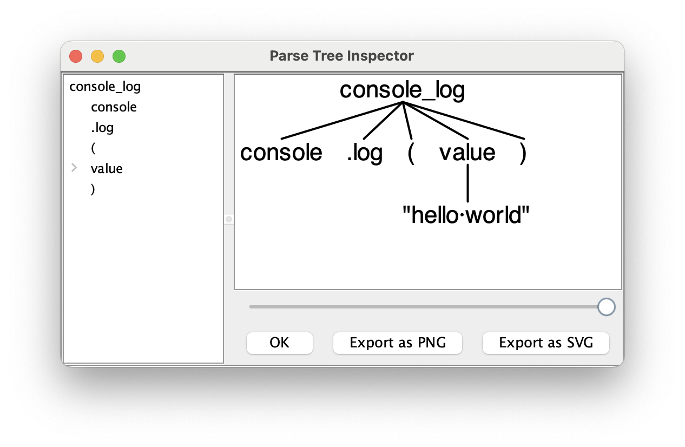
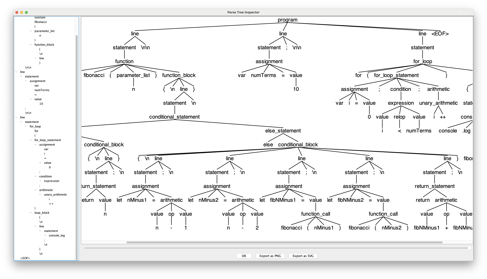

# JavaScript 2 Python Transpiler

This project is an exploration in using [ANTLR4](https://antlr.org) grammars to create a simple transpiler that converts a subset of JavaScript lexical grammar to valid Python3 grammar.

## Table of Contents
- [JavaScript 2 Python Transpiler](#javascript-2-python-transpiler)
  - [Table of Contents](#table-of-contents)
  - [Prerequisites](#prerequisites)
  - [Installation](#installation)
    - [ANTLR4 installation \& setup](#antlr4-installation--setup)
    - [Installing antlr4-python3-runtime 4.11.1](#installing-antlr4-python3-runtime-4111)
  - [Usage](#usage)
  - [Transpiler in action](#transpiler-in-action)
  - [Current Features](#current-features)
  - [Debugging](#debugging)
  - [:warning: Known Issues](#warning-known-issues)
  - [~~LICENSE~~ LICENCE](#license-licence)


## Prerequisites

- Java
- ANTLR4
- Python3
- antlr4-python3-runtime 4.11.1 
- make
- venv (optional)
- Node.js (optional, to run and verify JavaScript programs that will be transpiled to Python)

## Installation

The transpiler needs a bit of installation before use. 

### ANTLR4 installation & setup

ANTLR needs a bit of setup, run the following commands:

```bash
# Install ANTLR4
curl --remote-name https://www.antlr.org/download/antlr-4.11.1-complete.jar
sudo mv antlr4.11.1-complete.jar /usr/local/lib

if [[ "$OSTYPE" == "darwin"* ]]; then
    echo 'export CLASSPATH=".:/usr/local/lib/antlr-4.11.1-complete.jar:${CLASSPATH}"' >> ~/.zprofile
    echo 'alias antlr4='java -Xmx500M -cp "/usr/local/lib/antlr-4.11.-complete.jar:${CLASSPATH}" org.antlr.v4.Tool'' >> ~/.zshrc
    echo 'alias grun='java org.antlr.v4.gui.TestRig'' >> ~/.zshrc
    source ~/.zshrc
else
    echo 'export CLASSPATH=".:/usr/local/lib/antlr-4.11.1-complete.jar:${CLASSPATH}"' >> ~/.profile
    echo 'alias antlr4='java -Xmx500M -cp "/usr/local/lib/antlr-4.11.-complete.jar:${CLASSPATH}" org.antlr.v4.Tool'' >> ~/.bashrc
    echo 'alias grun='java org.antlr.v4.gui.TestRig'' >> ~/.bashrc
    source ~/.bashrc
fi
```

Alternatively, you can just run [antlr-setup.sh](antlr-setup.sh).

### Installing antlr4-python3-runtime 4.11.1 

It is highly recommended to use a virtual environment to install the required Python package. 

```bash
$ pip install antlr4-python3-runtime==4.11.1
```

## Usage

To run the transpiler, run the following commands:

```bash
make
python main.py <input-javascript-file>
```

The transpiler Python code will be outputted to a file called `output.py`.

## Transpiler in action

Running the transpiler for the following [`numberParity.js`](./examples/numberParity.js) JavaScript program:


```javascript
function calculateSum(a, b) {
    var result = a + b;
    return result;
}

function printSquare(num) {
    console.log(num * num);
}

function isEven(num) {
    let remainder = num % 2;
    if (remainder == 0) {
        return true;
    } else {
        return false;
    }
}

var x = 5;
var y = 3;
var sum = calculateSum(x, y);

console.log("The sum of", x, "and", y, "is", sum);

if (isEven(sum)) {
    console.log(sum, "is an even number.");
} else {
    console.log(sum, "is an odd number.");
}
```

Gives an output of:

```python
def calculateSum(a,b):
	result = a+b
	return result

def printSquare(num):
	print(num*num)

def isEven(num):
	remainder = num%2
	if remainder==0:
		return True
	else: 
		return False


x = 5
y = 3
sum = calculateSum(x,y)
print("The sum of",x,"and",y,"is",sum)
if isEven(sum):
	print(sum,"is an even number.")
else: 
	print(sum,"is an odd number.")

```

or running the transpiler for the following [`fibonacci.js`](./examples/fibonacci.js) JavaScript program:

```javascript
function fibonacci(n) {
    if (n <= 1) {
        return n;
    } else {
        let nMinus1 = n-1;
        let nMinus2 = n-2;
        let fibNMinus1 = fibonacci(nMinus1);
        let fibNMinus2 = fibonacci(nMinus2);
        return fibNMinus1 + fibNMinus2;
    }
}

var numTerms = 10;

for (var i = 0; i < numTerms; i++) {
    console.log(fibonacci(i));
}
```

Gives an output of:

```python
def fibonacci(n):
	if n<=1:
		return n
	else: 
		nMinus1 = n-1
		nMinus2 = n-2
		fibNMinus1 = fibonacci(nMinus1)
		fibNMinus2 = fibonacci(nMinus2)
		return fibNMinus1+fibNMinus2


numTerms = 10
for i in range(0, numTerms):
	print(fibonacci(i))

```

If you've used the transpiler on any other JavaScript programs, feel free to add them to the [`examples`](./examples) directory and submit a pull request!

## Current Features

The transpiler currently supports the following JavaScript features:

- [x] `console.log()` to `print()` ([`hello-world.js`](./examples/hello-world.js))
- [x] variable assignment supporting `let`, `var` and `const` ([`variable-assignment.js`](./examples/variable-assignment.js))
- [x] variable reassignment ([`variable-reassignment.js`](./examples/variable-reassignment.js))
- [x] arithmetic (supporting addition `+`, subtraction `-`, multiplication `*`, division `/`, modulus `%`, exponentiation `**`, increment `++`, decrement `--`) ([`arithmetic.js`](./examples/arithmetic.js))
- [x] array declaration, access, concatenation, push, pop, and length ([`array.js`](./examples/array.js))
- [x] while loop ([`while-loop.js`](./examples/while-loop.js))
- [x] for loop ([`for-loop.js`](./examples/for-loop.js))
- [x] if statement ([`if-statement.js`](./examples/if-statement.js))
- [x] function declaration and invocation ([`function.js`](./examples/function.js))
- [x] ternary operator ([`ternary-statement.js`](./examples/ternary-statement.js))

## Debugging

Debugging is done via `grun` (ANTLR's TestRig) (already installed and alias'd in the setup script) and the following commands:

```bash
make java
grun SubsetJavaScript <rule-name> [-tree | -gui]
```

where `<rule-name>` is the name of the rule you want to test. For example, to test the `console.log()` rule, run:

```bash
make java
grun SubsetJavaScript console_log -tree
console.log("hello world") # enter this line and then hit Ctrl+D
```

It will output `(console_log console .log ( (value "hello world") ))` which is the parse tree for the `console.log("hello world")` statement.

Alternatively, you can run the following command to get a gui showing the parse tree:

```bash
make java
grun SubsetJavaScript console_log -gui
console.log("hello world")
```

Which gives a gui like this:



Running the entire [`fibonacci.js`](./examples/fibonacci.js) JavaScript program through `grun` gives the following parse tree:

```bash
make java
grun SubsetJavaScript program ./examples/fibonacci.js -gui
```


The screenshot of the gui:


## :warning: Known Issues

This projects is just an exercise in creating a transpiler using ANTLR and Python. I came about this idea when migrating a codebase from JavaScript to TypeScript, and couldn't help but acknowledge the little irony that TypeScript transpiles to JavaScript during runtime. While TypeScript is a superscript of JavaScript, I wondered what it would be like to create a source-to-source compiler (a transpiler) for two dissimilar languages. 

As such, there are many issues that have not yet been addressed and (for the sake of my sanity) probably will not be, anytime soon.

## ~~LICENSE~~ LICENCE

This project is ~~licensed~~ licenced under the MIT License - see the [~~LICENSE~~ LICENSE](LICENCE.txt) file for details.